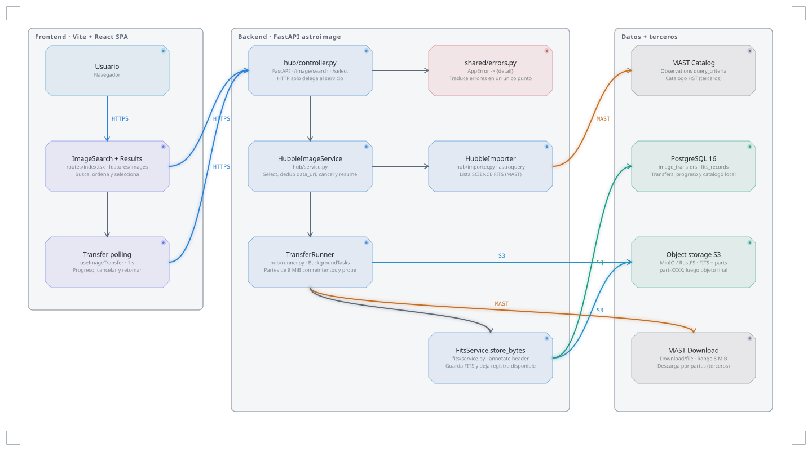

# Entrega 1 - Astroimage

En esta entrega se incorporan dos capacidades principales: buscar y obtener imágenes de Hubble, y explorar y analizar una imagen.

## Resumen Ejecutivo

El usuario puede buscar imágenes disponibles de Hubble, revisar los resultados, seleccionar una imagen y descargarla. La descarga informa su progreso y puede retomarse si fue interrumpida.

Una vez obtenida la imagen, el usuario puede visualizarla y analizar las fuentes presentes. Puede detectar fuentes puntuales y extendidas, ajustar los parámetros de detección y contrastar los resultados con Gaia. También puede consultar el histograma y el significado de los parámetros mediante el glosario.

### Decisiones tomadas

- La descarga se realiza por partes para poder mostrar el progreso y retomar una transferencia interrumpida.
- Las partes temporales se eliminan una vez que la imagen queda guardada.
- Los parámetros de detección pueden ajustarse según las características de cada imagen.
- Se mide el FWHM de la imagen para obtener información que permita recomendar parámetros de detección.
- Cuando no es posible realizar una medición confiable, no se genera una recomendación.
- La medición se realiza cuando el usuario la solicita.
- Las fuentes puntuales y extendidas se muestran como capas independientes sobre la imagen.
- Los errores producidos durante las operaciones se traducen en un único punto antes de llegar al cliente.

### Desafíos técnicos encontrados

- El servicio de Hubble no siempre informa inicialmente el tamaño total del archivo, por lo que fue necesario contemplar la descarga por partes.
- La verificación con Gaia puede requerir tiempo, por lo que se resuelve de forma asíncrona.
- Fue necesario distinguir entre una búsqueda sin detecciones y un error de configuración del detector.
- Se detectaron diferencias entre el contrato OpenAPI y el comportamiento real de algunos parámetros opcionales.

---

# User Stories

## US5 - Buscar y obtener imágenes

### Actor/es

Usuario.

### Funcionalidad

Como usuario, quiero buscar y seleccionar una imagen de Hubble para incorporarla a la aplicación y poder analizarla.

Puedo buscar un objeto celeste y consultar las imágenes disponibles. Puedo recorrer los resultados, ordenarlos y seleccionar la imagen que quiero obtener.

Al iniciar la descarga puedo consultar su progreso y cancelarla. Si la descarga se interrumpe, puedo retomarla posteriormente.

Cuando la descarga termina, la imagen queda disponible para ser visualizada y analizada.

### Valor aportado

Permite elegir la imagen que se quiere estudiar y obtenerla sin tener que gestionar manualmente la descarga desde el servicio externo.

### Criterios de aceptación

- Puedo buscar imágenes de Hubble indicando un objeto celeste.
- Puedo consultar y recorrer los resultados.
- Puedo ordenar los resultados.
- Puedo seleccionar una imagen para descargar.
- Puedo consultar el progreso de la descarga.
- Puedo cancelar una descarga.
- Una descarga interrumpida puede retomarse.
- Una descarga completada deja la imagen disponible para su análisis.

---

## US6 - Explorar y analizar imágenes

### Actor/es

Usuario.

### Funcionalidad

Como usuario, quiero explorar una imagen y analizar las fuentes que contiene.

Puedo visualizar una imagen y explorarla mediante zoom y desplazamiento. Puedo detectar fuentes puntuales y extendidas y ajustar los parámetros utilizados para la detección.

La aplicación puede recomendar parámetros a partir de las características de la imagen. También puedo consultar el histograma y acceder a información sobre los parámetros mediante el glosario.

Las detecciones obtenidas pueden contrastarse con información del catálogo Gaia para determinar su correspondencia con objetos registrados en dicho catálogo.

### Valor aportado

Permite analizar una imagen obtenida, identificar las fuentes presentes y contrastar los resultados con información astronómica externa.

### Criterios de aceptación

- Puedo visualizar una imagen descargada.
- Puedo explorar la imagen mediante zoom y desplazamiento.
- Puedo detectar fuentes puntuales.
- Puedo detectar fuentes extendidas.
- Puedo modificar los parámetros utilizados para la detección.
- Puedo obtener una recomendación de parámetros basada en las características de la imagen.
- Puedo consultar el histograma de la imagen.
- Puedo consultar información sobre los parámetros utilizados.
- Puedo contrastar las detecciones con el catálogo Gaia.
- Puedo consultar la correspondencia encontrada para las detecciones.

---

# Diagrama de arquitectura

El diagrama de arquitectura se realiza tomando como user story testigo **US5 - Buscar y obtener imágenes**.

Fuente del diagrama (Arc, tema `command` claro, brutalista minimal de colores saturados): [`./architecture/entrega1-us5.arc.json`](./architecture/entrega1-us5.arc.json).
Para regenerar el SVG (el CLI `arc` no expone temas; se usa el servidor MCP de Arc):
`npx -y @arach/arc check docs/architecture/entrega1-us5.arc.json` (sin diagnósticos),
`node docs/architecture/render-themed-svg.mjs docs/architecture/entrega1-us5.arc.json docs/architecture/entrega1-us5.svg command light transparent off` (fondo transparente, sin grilla)
y luego `python docs/architecture/enlarge-secondary-text.py` (agranda el texto secundario de 9px a 11.5px, ya que Arc no ofrece escala de tipografía).

Representa el flujo de búsqueda, selección y descarga de una imagen de Hubble hasta que queda disponible en la aplicación.
La mitad izquierda es el **frontend** (Vite + React SPA); el centro es el **backend** (FastAPI `astroimage`); la derecha son **datos y terceros**.
Los nombres son los componentes concretos del código, no tecnologías genéricas.

### Flujo (búsqueda → disponible)

1. El usuario busca un objeto (`ImageSearch + Results`) y recorre/ordena candidatas: `GET /image/search` → `HubbleImageService.search_candidates` → `HubbleImporter` (resuelve con `SkyCoord` y consulta `MAST Catalog` paginado) → orden, paginado y `candidate_token` firmado.
2. Al seleccionar, `POST /image/search/select` → `select_candidate`: si ya está `COMPLETED` o activa la devuelve; si es retomable hace `resume`; si el `data_uri` ya tiene registro lo marca `COMPLETED`; si no, crea el `ImageTransfer` en `QUEUED` y lo arranca en `BackgroundTasks` (`TransferRunner`).
3. `TransferRunner` hace `probe` (`Range: bytes=0-0`, con reintentos) y descarga por partes de 8 MiB (`read_range`) contra `MAST Download`, guardando cada parte en el object storage (`transfers/{id}/part-XXXX`) y el progreso/velocidad en PostgreSQL vía `TransferRepository` (patrón repositorio: sin flecha propia en el diagrama para no romper la grilla).
4. El frontend sondea `GET /image/transfers/{id}` cada segundo (`Transfer polling`) y ofrece cancelar/retomar (`cancel`/`resume`); una parte interrumpida se retoma desde `bytes_transferred` validando `etag`/`last-modified`.
5. Al completar las partes, el runner anota el header FITS y llama a `FitsService.store_bytes`: guarda el objeto final en el storage, crea el `fits_records` en PostgreSQL con proveniencia MAST, marca el transfer `COMPLETED` con `record_id`/`slug` y **purga las partes temporales**.
6. La imagen queda disponible: `GET /image` (con `cuerpo_celeste`, paginado y orden) la lista desde el catálogo local.
7. Los errores del flujo se traducen en `shared/errors.py` (`AppError` → cuerpo `{"detail": ...}`), un único punto antes del cliente.

### Componentes

| Componente | Responsabilidad |
|---|---|
| Usuario (navegador) | Actor de US5; busca, selecciona y sigue la descarga. |
| ImageSearch + Results (`frontend/src/routes/index.tsx`, `features/images`) | UI de búsqueda, orden/paginado de candidatas y selección; usa el cliente Orval generado desde OpenAPI con TanStack Query. Propio. |
| Transfer polling (`features/images/candidate-api.ts`, `useImageTransfer`) | Sondea `GET /image/transfers/{id}` cada 1 s, muestra progreso/velocidad y dispara cancelar/retomar. Propio. |
| hub/controller.py (FastAPI) | Solo HTTP: `GET /image/search`, `POST /image/search/select`, `GET/POST /image/transfers/{id}[/cancel\|/resume]`, `GET /image`; delega al servicio. Propio. |
| HubbleImageService (`hub/service.py`) | Orquesta búsqueda/select/dedup por `data_uri`, cancel/resume y arranque del runner. Propio. |
| HubbleImporter (`hub/importer.py`, astroquery) | Resuelve el objeto (`SkyCoord.from_name`), filtra productos `SCIENCE` FITS y arma `HubbleProduct`. Propio. |
| TransferRunner (`hub/runner.py`, `hub/mast_fetch.py`) | Descarga por partes de 8 MiB con `probe`, reintentos, validación de identidad (`etag`/`last-modified`) y registro de progreso. Propio. |
| TransferRepository (`hub/repository.py`) | Persiste `image_transfers` y el progreso; usado por `HubbleImageService` y `TransferRunner`. Sin flecha propia (repositorio). Propio. |
| FitsService.store_bytes (`fits/service.py`) | Anota el header, persiste el FITS final y crea el registro que deja la imagen disponible. Propio. |
| shared/errors.py | Traduce todos los errores a `AppError` con cuerpo `{"detail"}` en un único punto. Propio. |
| PostgreSQL 16 (`image_transfers`, `fits_records`) | Transfers con estado/progreso y catálogo local con proveniencia MAST. Propio (infraestructura). |
| Object storage S3 (MinIO / RustFS) | Partes temporales `transfers/{id}/part-XXXX` y objeto FITS final. Propio (infraestructura). |
| MAST Catalog (`Observations.query_criteria`, `get_product_list`) | Catálogo HST remoto por coordenadas. **Terceros** (STScI). |
| MAST Download (`Download/file` + `Range`) | Descarga del producto FITS. **Terceros** (STScI). |

Contrato: OpenAPI (`backend/openapi.json`) entre backend y frontend; el cliente se regenera con `pnpm generate:api` (Orval).

